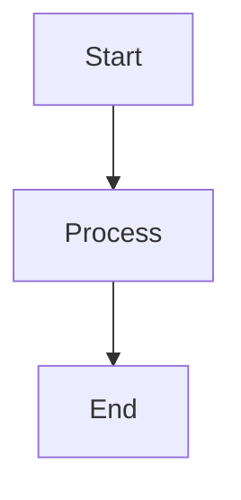

[日本語](README_ja.md)

# Mermaid Diagram Extractor

A Python tool to extract Mermaid diagrams from text files and JavaScript string literals, saving them as individual `.mmd` files. The tool can also convert the diagrams to SVG and PNG formats using mermaid-cli.

## Requirements

- Python 3.x
- @mermaid-js/mermaid-cli (for image generation)
```bash
npm install -g @mermaid-js/mermaid-cli
```

## Installation

```bash
git clone https://github.com/yourusername/mermaid-tools.git
cd mermaid-tools
```

## Usage

Two scripts are provided for different use cases:

### extract_mermaid.py

Extracts Mermaid diagrams from Markdown or text files.

```bash
# Basic usage (outputs .mmd files only)
python extract_mermaid.py sample.txt

# Generate multiple formats (.mmd, .svg, .png)
python extract_mermaid.py sample.txt --formats mmd svg png

# Specify output directory
python extract_mermaid.py sample.txt --output-dir ./output

# Validate syntax only
python extract_mermaid.py sample.txt --validate-only
```

### extract_mermaid_from_js.py

Specializes in extracting Mermaid diagrams from JavaScript string literals, particularly useful for Next.js-generated content.

```bash
# Basic usage
python extract_mermaid_from_js.py sample_js.txt

# Generate multiple formats
python extract_mermaid_from_js.py sample_js.txt --formats mmd svg png
```

## Output Directory Structure

The scripts create an organized output directory structure:

```
output/
├── mmd/    # Mermaid source files
│   ├── sample_01.mmd
│   └── sample_02.mmd
├── svg/    # SVG format images
│   ├── sample_01.svg
│   └── sample_02.svg
└── png/    # PNG format images
    ├── sample_01.png
    └── sample_02.png
```

## Input File Formats

### For extract_mermaid.py

Standard Markdown/text files with Mermaid code blocks:

````

````

### For extract_mermaid_from_js.py

JavaScript files containing Mermaid diagrams as string literals:

```javascript
<script>self.__next_f.push([
  1,
  "```mermaid\ngraph TD\n    A[Start] --> B[Process]\n    B --> C[End]\n```"
])</script>
```

## Command Line Options

Both scripts support the following options:

```
--formats: Output formats (mmd, svg, png). Default: mmd
--output-dir: Output directory path. Default: current directory
--validate-only: Perform syntax validation without generating files
```

For example:
```bash
python extract_mermaid.py input.md --formats mmd svg png --output-dir ./diagrams
```

## License

This project is open source and available under the MIT License.
