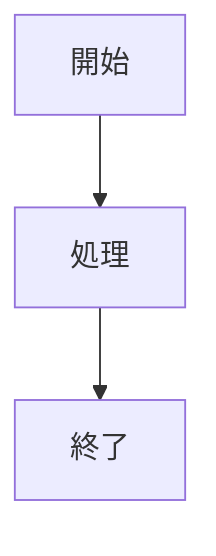

[English](README.md)

# Mermaid ダイアグラム抽出ツール

[](https://www.python.org/)
[](https://opensource.org/licenses/MIT)
[](https://mermaid.js.org/)

テキストファイルやJavaScript文字列リテラルからMermaidダイアグラムを抽出し、個別の`.mmd`ファイルとして保存するPythonツールです。mermaid-cliを使用してSVGやPNG形式の画像としても出力できます。

## 必要条件

- Python 3.x
- @mermaid-js/mermaid-cli（画像生成用）
```bash
npm install -g @mermaid-js/mermaid-cli
```

## インストール

```bash
git clone https://github.com/yourusername/mermaid-tools.git
cd mermaid-tools
```

## 使用方法

用途に応じて2つのスクリプトを提供しています：

### extract_mermaid.py

MarkdownやテキストファイルからMermaidダイアグラムを抽出します。

```bash
# 基本的な使用方法（.mmdファイルのみ出力）
python extract_mermaid.py sample.txt

# 複数フォーマットでの出力（.mmd, .svg, .png）
python extract_mermaid.py sample.txt --formats mmd svg png

# 出力ディレクトリの指定
python extract_mermaid.py sample.txt --output-dir ./output

# 構文検証のみ実行
python extract_mermaid.py sample.txt --validate-only
```

### extract_mermaid_from_js.py

JavaScript文字列リテラルからMermaidダイアグラムを抽出します。特にNext.jsで生成されたコンテンツに適しています。

```bash
# 基本的な使用方法
python extract_mermaid_from_js.py sample_js.txt

# 複数フォーマットでの出力
python extract_mermaid_from_js.py sample_js.txt --formats mmd svg png
```

## 出力ディレクトリ構造

スクリプトは以下のような構造で出力ディレクトリを作成します：

```
output/
├── mmd/    # Mermaidソースファイル
│   ├── sample_01.mmd
│   └── sample_02.mmd
├── svg/    # SVG形式の画像
│   ├── sample_01.svg
│   └── sample_02.svg
└── png/    # PNG形式の画像
    ├── sample_01.png
    └── sample_02.png
```

## 入力ファイル形式

### extract_mermaid.py の場合

Mermaidコードブロックを含む標準的なMarkdown/テキストファイル：

````

````

### extract_mermaid_from_js.py の場合

Mermaidダイアグラムを文字列リテラルとして含むJavaScriptファイル：

```javascript
<script>self.__next_f.push([
  1,
  "```mermaid\ngraph TD\n    A[開始] --> B[処理]\n    B --> C[終了]\n```"
])</script>
```

## コマンドラインオプション

両スクリプトは以下のオプションをサポートしています：

```
--formats: 出力形式（mmd, svg, png）。デフォルト: mmd
--output-dir: 出力ディレクトリのパス。デフォルト: カレントディレクトリ
--validate-only: ファイル生成を行わず、構文検証のみを実行
```

使用例：
```bash
python extract_mermaid.py input.md --formats mmd svg png --output-dir ./diagrams
```

## ライセンス

このプロジェクトはオープンソースで、MITライセンスの下で利用可能です。
